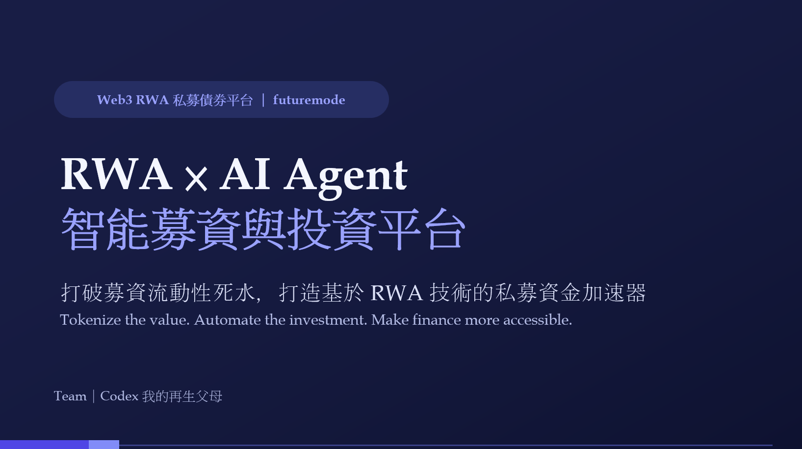
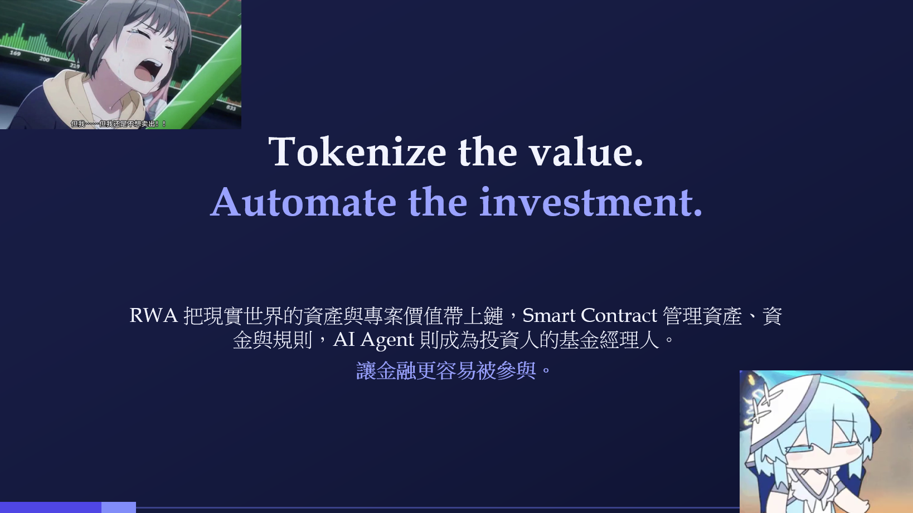

# RWA × AI Agent 智能投資募資平台

[](https://nextjs.org/)
[](https://react.dev/)
[](https://www.typescriptlang.org/)
[](https://tailwindcss.com/)
[](https://fastapi.tiangolo.com/)
[](https://www.python.org/)
[](https://solana.com/)
[](https://platform.openai.com/)
[](https://docs.astral.sh/uv/)
[](#10-disclaimer)

> **AI Agent × RWA × Blockchain**



---

# 1. 專案簡介

本專案是一個結合 **Real World Assets（RWA）、區塊鏈與 AI Agent** 的新型募資與投資平台。

<h1 align="center" style="font-size: 60px;">
  <a href="./專案簡報.pdf">📄 點此查看我們的專案簡報（PDF）</a>
</h1>



---

# 2. 我們想解決什麼問題？

## 2.1 傳統募資的問題

許多具有潛力的專案並不是沒有價值，而是缺乏取得資金的管道。

例如：

* 小農需要資金進行農地轉型
* 新創公司想研究新的半導體技術
* 商家想購買設備擴大營運
* 創作者需要資金製作新產品
* 新創公司有新的商業提案，但尚未產生穩定營收

這些專案可能具有實際資產或未來收益，但傳統金融市場往往需要較高的門檻與成本才能進入。

---

## 2.2 一般投資人的問題

另一方面，一般投資人即使有資金，也可能面臨：

* 不知道哪些專案值得投資
* 缺乏金融與產業分析能力
* 沒時間持續追蹤投資標的
* 不知道什麼時候應該買入或賣出
* 難以理解複雜的金融產品
* 投資決策容易受到情緒影響

因此，我們希望讓 AI Agent 成為使用者的「**個人基金經理人**」。

---

# 3. 專案結構

這個 repo 的功能拆在不同資料夾、各自是可以獨立啟動的服務，詳細說明請點進各資料夾自己的 README：

| 資料夾 | 說明 | 技術 |
| --- | --- | --- |
| [`frontend/`](./frontend) | 使用者網頁介面：瀏覽／贊助／投資 RWA 專案、連接 Solana 錢包、AI Agent 聊天 UI | Next.js、React、TypeScript |
| [`backend/`](./backend) | 募資資料 API：專案列表、認購、購買股份、鏈上交易紀錄（目前為記憶體 mock 資料層） | FastAPI、Python |
| [`rwa-agent/`](./rwa-agent) | AI Agent 服務：OpenAI Tool Calling 驅動的個人基金經理人，串接 `backend` 資料並用 Solana devnet 錢包實際下單 | FastAPI、OpenAI、Solana |
| [`blockChain/`](./blockChain) | Solana 智能合約（Anchor / Rust），規劃中的鏈上邏輯層 | Anchor、Rust |

三個服務（`frontend` / `backend` / `rwa-agent`）怎麼互相呼叫、本機怎麼啟動、Cloudflare Tunnel 怎麼開，詳見 [`frontend/README.md`](./frontend/README.md)。

---

# 4. 為什麼是 RWA？

RWA（Real World Assets）可以將現實世界中的資產或價值，以 Token 的形式映射至區塊鏈，並在鏈上完成發行、持有、轉移、贖回與資金分配。

```text
實體資產 / 專案價值
        ↓
   價值評估與驗證
        ↓
      RWA Token
        ↓
      Blockchain
        ↓
     投資人交易
```

**核心價值：**

1. **資產可以被 Token 化** — RWA Token 不是單純的虛擬貨幣，而是與現實世界的資產、債權或收益綁定。
2. **降低投資參與門檻** — 大額資產拆分成小額 Token，讓原本只有大型機構能參與的資產，變得人人可投資。
3. **可程式化的交易機制** — 發行、持有、贖回、資金分配都能透過鏈上機制自動執行。

例如，一間新創公司想購買昂貴的研究設備但缺乏資金：

```text
提出專案 → 資產與價值評估 → 建立 RWA Token → 公開募資 → 投資人購買 Token → 平台管理資金池
```

即使專案最終未如預期成功，Token 背後的實體資產（如設備）仍可能保有市場價值，因此 RWA Token 不是單純建立在「成功預期」之上，而是可以進一步建立在可驗證的資產價值之上。這也是我們將 **AI Agent + Blockchain** 結合的原因。

---

# 5. AI Agent：個人基金經理人

本專案最核心的功能，是建立一個能夠自主執行投資流程的 AI Agent —— 不只是聊天機器人，而是能夠「**感知 → 分析 → 制定策略 → 執行**」的 Agent。

```text
                 使用者
                    │
                    ▼
             設定投資偏好
                    │
                    ▼
             ┌──────────────┐
             │   AI Agent   │
             │  資訊蒐集     │
             │  風險分析     │
             │  投資評估     │
             │  策略制定     │
             └──────┬───────┘
                    │
                    ▼
                 買入 RWA
                    │
                    ▼
                 Wallet
```

**AI Agent 可以做什麼：**

* 蒐集並分析專案資料、資產價值、市場狀況等資訊，產生投資分析
* 依使用者設定的風險偏好（也可用自然語言描述，如「報酬率高一點，但不要承擔太大本金損失」）轉換成投資策略
* 判斷 RWA Token 符合條件時，透過 Wallet 自動執行買入，使用者不需要每次手動操作

**AI Agent Tool Calling**：透過 OpenAI Tool Calling 機制，讓 Agent 呼叫後端與鏈上功能，目前已實作：

```text
get_rwa_assets()
get_wallet_balance()
get_risk_score()
buy_rwa()
```

讓 LLM 不只是「回答投資建議」，而是能夠真正執行可控的金融操作。

**Wallet Integration**：使用者透過 Wallet 與平台互動，AI Agent 代為執行鏈上交易。

```text
User → Web Frontend → AI Agent → Wallet → Blockchain
```

> RWA 解決「資產如何上鏈與被投資」；AI Agent 解決「投資人如何理解、管理與交易這些資產」，兩者互補。

---

# 6. 安全性與信任機制

金融 Agent 最大的問題不是「能不能交易」，而是「**AI 能不能被允許無限制地交易？**」我們規劃將 AI Agent 與資金權限分離，讓 Agent 在可控範圍內自動化（目前尚未實作，屬於後續規劃項目）。

我們也不認為所有金融功能都必須完全去中心化，而是可以採取 **Blockchain + AI + Trusted Financial Institution** 的混合模式，同時兼顧鏈上透明性、AI 自動化與金融機構的信任與合規能力：

```text
             國泰金控
                │
       ┌────────┼────────┐
       ▼        ▼        ▼
      KYC      RWA      Risk
              Verify    Control
       │        │        │
       └────────┼────────┘
                ▼
            Blockchain
                │
                ▼
            AI Agent
                │
                ▼
             Investor
```

---

# 7. 商業模式、MVP 範圍與技術 Stack

**商業模式**（未來可能的獲利方向）：

| 收入來源 | 說明 |
| --- | --- |
| RWA 發行費 | 專案建立 RWA Token 的服務費 |
| 交易手續費 | RWA Token 買賣抽成 |
| AI Agent 訂閱 | 個人基金經理人服務 |
| 資產管理費 | AI 投資組合管理 |
| 金融服務 | KYC、託管、驗證等 |
| B2B API | 提供企業 RWA / Agent 基礎設施 |

**MVP Architecture**（本次 Hackathon 聚焦展示核心概念，不需完整金融市場）：

```text
                 ┌─────────────┐
                 │   Frontend  │
                 └──────┬──────┘
                        │
                        ▼
                 ┌─────────────┐
                 │  AI Agent   │
                 └──────┬──────┘
                        │
              ┌─────────┼─────────┐
              ▼         ▼         ▼
          RWA Data   Risk Data  Market Data
              │         │         │
              └─────────┼─────────┘
                        ▼
                    Wallet
                        │
                        ▼
                   Demo Chain
```

**技術 Stack**：

* **Frontend**：React / Next.js、Web3 Wallet Integration
* **AI**：LLM、AI Agent、OpenAI Tool Calling、外部情資查詢
* **Blockchain**：Solana Devnet、鏈上 Token 轉帳
* **Backend**：Python（Agent API、RWA / Market Data API）

---

# 8. Demo 情境

2–3 分鐘 Demo 故事線：

1. **新創募資** — 一間半導體新創公司需要購買研究設備（Funding Target：等值 SOL），平台將其資產與專案價值 Tokenization。
2. **投資人進場** — 使用者連接 Wallet，輸入「我有 10,000 SOL，希望中度風險投資科技類 RWA」，AI Agent 開始分析。
3. **AI Agent 投資** — Agent 分析多個 RWA（風險與分數各異），自動配置資金完成買入。

---

# 9. 專案分工與待補強方向

| 成員 | 負責項目 |
| --- | --- |
| LT | 使用者需求、提案、方向 |
| Gimi | RWA 應用、競品、募資情境 |
| Sean | Private Chain |
| Ying | RWA、使用者情境 |
| Amelie | AI Agent、Frontend |
| Alex | 技術方向、資金經理人 Agent、數據與安全性 |
| 全員 | 商業模式、Demo、簡報 |

**接下來需要補強**：RWA 市場數據與 Tokenization 案例、競品研究（銀行 RWA 服務、RWA Marketplace、AI Investment Agent 等）、安全性研究（Agent Wallet Security、Transaction Limit、KYC/AML、RWA 資產驗證）。

---

# 10. Disclaimer

本專案目前為 Hackathon / Proof of Concept。Demo 中使用的 RWA Token、SOL、資產價格及交易皆為測試或模擬用途，不代表實際投資商品，也不構成任何投資建議。

實際上線仍需要進一步處理：金融法規、證券法規、KYC/AML、資產託管、RWA 資產驗證、AI 決策風險、使用者資產安全，以及風險如何可控。

---

# 11. References

* RWA Hackathon Taiwan — https://hackathon.com.tw/winners
* Hackathon Track — https://hackathon.com.tw/tracks/w4VERnRA0NQD3MiJfWnt
* RWA / Blockchain Reference — https://github.com/hugebing/blygccrryryy

---

## TL;DR

**RWA** 負責把現實世界的資產與專案價值帶到區塊鏈。**AI Agent** 則成為投資人的「基金經理人」，負責分析資訊、評估風險、管理投資組合，並在使用者授權的範圍內自動執行交易。

```text
        Real World Assets
                │
                ▼
          RWA Tokenization
                │
                ▼
           Blockchain
                │
                ▼
        ┌───────────────┐
        │   AI Agent    │
        │  Analyze      │
        │  Decide       │
        │  Execute      │
        └───────┬───────┘
                │
                ▼
             Wallet
                │
                ▼
            Investor
```

> **Tokenize the value.
> Automate the investment.
> Make finance more accessible.**
